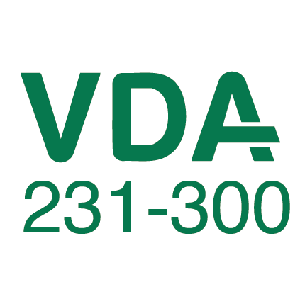
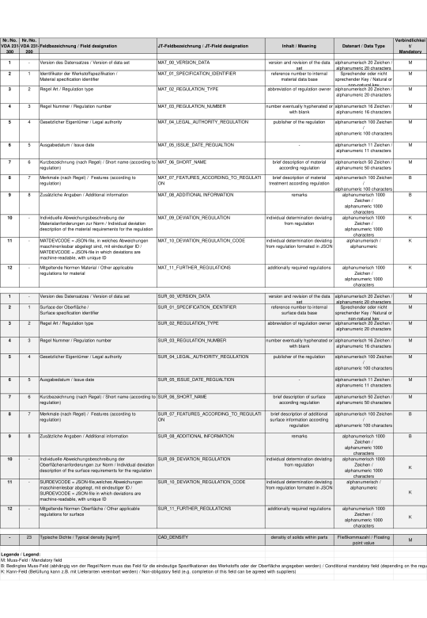

# VDA 231‑300 – Embedding of Material and Surface Requirements in 3D Data
🔗 This subschema is part of the **VDA 231‑301 open JSON standard ecosystem**
➡ https://github.com/VDA231-301

## Purpose and Scope

The **VDA 231‑300 recommendation** defines a standardized approach for the **description and embedding of material and surface requirements directly into 3D datasets**.

Its primary goal is to enable a **consistent, machine‑readable, and CAD‑neutral representation** of material‑related information throughout the product lifecycle, from design to downstream processes such as simulation, manufacturing, quality assurance, and data exchange.

The recommendation uses the **JT data format** (ISO 14306) as a neutral carrier and specifies how material and surface requirements are embedded as **attribute–value pairs** at individual bodies within a 3D model.

---

## Position within the VDA 231‑301 Ecosystem

VDA 231‑300 complements the **VDA 231‑301 recommendation** by addressing the **geometric and CAD‑related representation** of material and surface requirements, whereas VDA 231‑301 focuses on the **digital exchange of material test and approval data**.

Together, the two recommendations support a **continuous digital material information flow**:
- **VDA 231‑300**: embedding material and surface requirements in the 3D dataset  
- **VDA 231‑301**: exchanging material‑related test and approval results in a structured data format

This repository provides **technical examples and documentation** related to VDA 231‑300 and does not replace the official VDA publication.

---

## Technical Concept

Within a 3D dataset, material and surface requirements are:
- anchored at **individual geometric bodies**,
- represented as **attribute–value pairs**,
- uniquely assigned to each body in the design model.

This approach allows material‑related information to be:
- digitally evaluable,
- consistently interpreted by downstream systems,
- reused across different tools and processes without manual re‑interpretation.

By relying on a **CAD‑neutral data format**, the concept supports interoperability across different CAD systems and IT landscapes.
---

## Relation to International Standards
---
The contents of VDA 231‑300 have been incorporated into:
- **DIN SPEC 91383**
- the public library of **ISO 14306 (JT format)**

This highlights the relevance and acceptance of the approach beyond a single organization or industry context.

Reference:
- https://standards.iso.org/iso/14306/-4/ed-1/en/

---

## Applicability Beyond the Automotive Industry

Although VDA 231‑300 originates from the automotive context, its underlying concept is **not limited to the automotive industry**.

Any industry working with:
- complex 3D product models,
- material‑dependent requirements,
- digital product definitions

can benefit from embedding material and surface information directly into 3D datasets, for example:
- aerospace
- mechanical and plant engineering
- industrial equipment
- construction and infrastructure products

The recommendation focuses on **data structure and interoperability**, not on industry‑specific processes.

---

## Important Note

> [!IMPORTANT]
> This repository provides **technical documentation and examples only**.  
> It does **not** define legally binding requirements and does **not** replace
> the official VDA 231‑300 recommendation published by the VDA.
> The authoritative normative content is available via the **VDA Webshop**.

---

## License

The contents of this repository are released under the **MIT License**, allowing free use, modification, and distribution.

Contributions are welcome.  
Any changes intended to become part of the official VDA 231‑300 recommendation must follow the formal VDA committee and release process.

## Contributing & VDA Process

This repository hosts the material and surface properties of VDA 231-300.

Contributions are welcome.  

Any changes intended to become part of the official VDA 231‑300 recommendation must follow the formal VDA committee and release process.

GitHub is used as a platform for collaborative drafting, discussion, and technical refinement.  
Issues and Pull Requests are welcome.

⚠️ Please note:  
Only subschemas that have successfully passed the formal VDA committee and release process may become part of the official VDA 231‑301 recommendation.

Details on contribution rules, governance, and approval processes are described in the organization-wide Contributing Guidelines:  
https://github.com/VDA231-301/.github/blob/main/CONTRIBUTING.md
